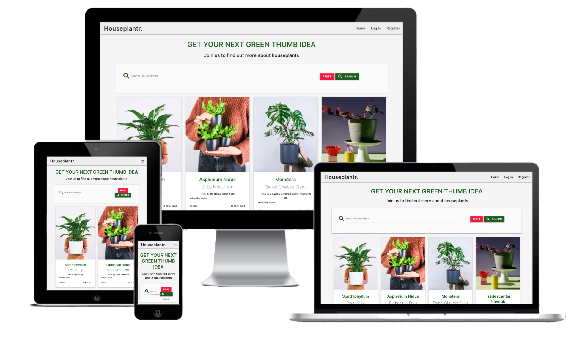
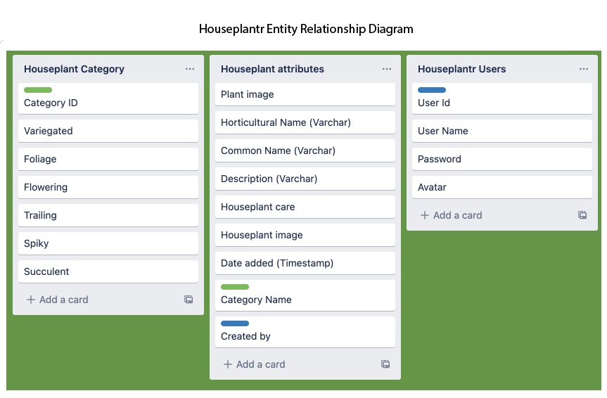

# Houseplantr App

[Houseplantr live site](https://houseplantr-v1.herokuapp.com/)

Want to share your houseplant love? Join our community on Houseplantr and share your knowledge and Houseplant recommendations with others. Create your free account, and upload and share your favourite houseplants and houseplant tips with the community.

# About Houseplantr

With the rise of social media platforms such as Instagram there has been a profound change in the tastes and habits of even established gardeners. Online stardom for Houseplants has meant a growth in the popularity of appealing varieties, including plants that haven’t been in demand since the 1970s. Houseplants have become more appealing – especially amongst audiences who may not have their own garden. 

Houseplant lovers have already demonstrated their enthusiasm for online platforms where they can share their favourite houseplants and get new ideas. There is also a demand for information on how to care for and grow new plants from cuttings. 

My app Houseplantr has been developed specifically for people who love Houseplants and who want to share images of their best houseplants and tips for houseplant care with others. It is designed to allow users to create a profile and display images of their Houseplants with a description and tips on caring for the houseplant. The app would contribute to developing and build a cross platform community of people who love houseplants

I have created the functionality within the app to allow users to create, locate, display, edit and delete houseplant records (CRUD functionality). I have also added links to a potential podcast development on YouTube with associated social media channels where houseplant enthusiasts can share knowledge and learn more about houseplants. 

A future ecommerce opportunity could be a marketplace where users can buy and sell cuttings, and develop a seed library.

This is a project to complete the requirements of the Code Institute Diploma in Web Development Milestone Project 3 

# User Experience:
## User stories

### As a first time visitor:
    - I want to easily understand the main purpose of the site on all devices including mobile, ipad and desktop.
    - I want to be able to easily navigate throughout the site, find out more about the content of the site and build trust in the brand.
    - I want to be able to find out how users can interact with the app.
    - I want to be able to easily register as a user.
    - I want to be able to log out of my account.

### As a returning visitor:
    - I want to read about a wide range of houseplants and how to care for them on the app.
    - I want to be able to search the database to view specific houseplants.
    - I want to be able to upload my best houseplant images and information and display them on Houseplantr.
    - I want to be able to edit my houseplant records.
    - I want to delete houseplants I don’t want on my profile.

### Nice to have:
    - I would like to be able to filter and view my uploaded houseplants collection. 
    - I would like to be able to delete my account.

# Design:
## Colour scheme
    I have chosen to use the colour green primarily, alongside grey and black & also red as a contrasting accent colour.   
    Green is universally associated with nature, and references the organic properties of houseplants.   
    A subtle light grey which makes the layout background sit further back visually behind the houseplant ‘cards’, creating a subtle 3d effect.  
    Red is used as a warning colour on buttons used for deletion. 
    - #1b5e20 dark green
    - #ff1744 red accent
    - #f8f8f8 light grey
    - #222222 black

## Typography
    Inter is the font family used across the app with sans-serif as a fall-back font.   
    Inter is a variable font with 9 weights specifically designed for computer screens by Rasmus Andersson. Inter is a free and open source font available via Google Fonts.
## Images 
    Imagery creates impact across the app and is key to visitor use and enjoyment of the app. The app features user generated content selected by users to display their own houseplants.   
    Many of the images used for demonstration purposes, have been selected from sites including Pexels and Unsplash with an attribution provided in the READme.
# Wireframes
All my wireframes have been created in Adobe XD. I am familiar with Adobe programmes so I am more efficient. You can see my wireframes in the folder [here](/wireframes)

# Database Design
I have structured a database using [MongoDB](https://www.mongodb.com/), a document-oriented database program to support the Houseplantr app.  
I created a database structure within a collection, to store Houseplants & their attributes, user information and houseplant categories.

# Features:
- Responsive on all device sizes
- Interactive elements
- Profile registration/Log-in functionality
- Create, Read, Update & Delete records
- User generated content

## Potential Features
- Add a selection of avatars for new users to choose for their Houseplantr profile page.
- Ability for users to filter just their own houseplants added to the app
## Promotional Opportunity
- Build upon plant care on the card reveal section, to promote a Houseplantr podcast on YouTube.
- Add links from the app to Houseplantr's social media sites.

# Technologies Used:
## Languages 
- HTML
- CSS
- JS
- Python

## Frameworks, Libraries & Programs
- Materialize 1.0.0
    - Materialize was used to assist with the responsiveness and styling of the website; especially useful are the features for creating forms.
- Google Fonts
    - Google Fonts was used - specifically the 'Inter’ web font, which is used for all text within the app
- Font Awesome
    - Font Awesome was used for icons such as the ‘leaf’ on the registration page as well as for social icons, for aesthetic and UX purposes.
- jQuery
    - jQuery was used for javascript functionality
- Git
    - Git was used for version control by utilizing the Gitpod terminal to commit to Git and Push to GitHub.
- Github
    - GitHub was used to store the project's code after being pushed from Git.
- Adobe XD: version 49.0.12.14
    - Adobe XD was used to create the logo and wireframes for the app. I used this because I am familiar with Adobe products and shortcuts to speed up development. Also EKC Group provides free student access to XD. I will try out Balsamiq in the future. 
- Adobe Photoshop: version 23.2.2
    - Adobe Photoshop was used to resize images and edit photos for the app.
- Flask
    - Flask was used as a micro-framework; (it’s a Python module that allows development of web applications easily.)
- Heroku
    - The project was deployed to Heroku. Heroku is a platform as a service (PaaS) that enables developers to build, run, and operate applications entirely in the cloud.
- MongoDB
    - MongoDB was used to store the data required for the project. It is a document-oriented NoSQL database used for high volume data storage.

# Testing:    
## Creating an account
I have created an admin account which has access to categories pages in addition to the main account pages, a personal account and 6 test accounts in order to test the functionality of the website. 
## Add, Edit & delete a houseplant record
I added a number of fake records to test the add houseplant form functioned correctly, I edited records and then finally deleted them. 
## Further Testing
- The App was tested on Google Chrome, Internet Explorer, Microsoft Edge and Safari browsers.
- The App was viewed on a variety of devices such as Desktop, Laptop, iPad Air, iPhone SE, iPhone12 Pro , Surface Duo and Samsung Galaxy.
- Testing was done to ensure that all pages were linking correctly.
# Validators:
### HTML:

### W3C Markup Validator 
Apart from the Jinga templating language that the validator is not able to read, the code is validating with no errors shown
### CSS
### W3C CSS Validator 
Write this up shortly
### Javascript
### Jshint
Write this up shortly
### Python
### PEP8 Online
All .py files are PEP8 compliant.

# Credits:

## Media:
- Demo images [Unsplash](https://unsplash.com/)
- Avatars [Flaticon garedening stickers](https://www.flaticon.com/search?word=plants&type=sticker)

## Code
- Copyright Date Script [Tim Nelson](https://github.com/TravelTimN)
- Defensive programming [Tim Nelson](https://github.com/TravelTimN)

# Bugfixes:
## Editing a record/category method
I used the update() method in the original Code Institute video within the edit function, but this didn’t work due to Pymongo having been updated by the developers & it caused an error. I then tried the update_one method as outlined in [W3 schools](https://www.w3schools.com/python/python_mongodb_update.asp)  
When that didn't work either, I research online and found a fix from [Stack Overflow](https://stackoverflow.com/questions/30605638/why-does-upsert-a-record-using-update-one-raise-valueerror) where replace_one was recommended and that worked. 
## Deleting a record/category method 
The method remove() did not work when writing code to delete a record or category due to Pymongo being updated by the developers. After reading about this issue on the Code Institute Slack discussion board I discovered that the method remove() was now depreciated in Pymongo 4. The fix was to use the method delete_one instead.

