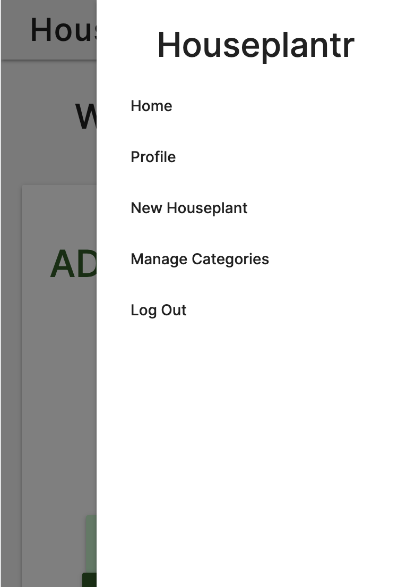
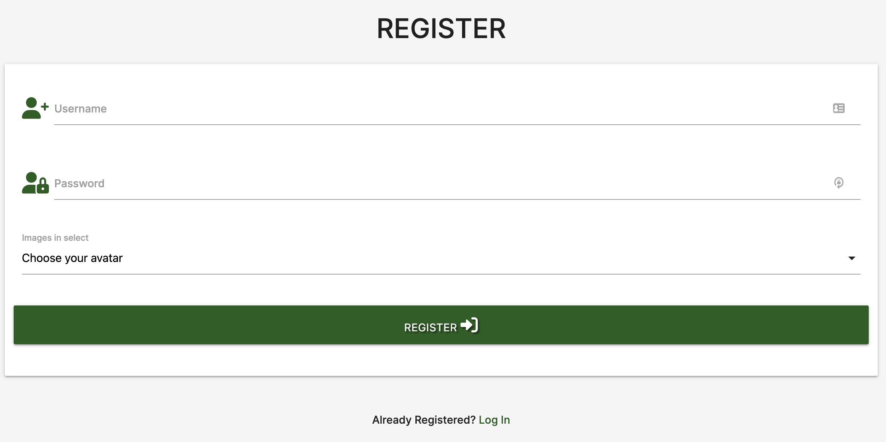

# Houseplantr App

[Houseplantr live site](https://houseplantr-v1.herokuapp.com/)

Want to share your houseplant love? Join our community on Houseplantr and share your knowledge and Houseplant recommendations with others. Create your free account, and upload and share your favourite houseplants and houseplant tips with the community.

# About Houseplantr

With the rise of social media platforms such as Instagram there has been a profound change in the tastes and habits of even established gardeners. Online stardom for Houseplants has meant a growth in the popularity of appealing varieties, including plants that haven’t been in demand since the 1970s. Houseplants have become more appealing – especially amongst audiences who may not have their own garden. 

Houseplant lovers have already demonstrated their enthusiasm for online platforms where they can share their favourite houseplants and get new ideas. There is also a demand for information on how to care for and grow new plants from cuttings. 

My app Houseplantr has been developed specifically for people who love Houseplants and who want to share images of their best houseplants and tips for houseplant care with others. It is designed to allow users to create a profile and display images of their Houseplants with a description and tips on caring for the houseplant. The app would contribute to developing and build a cross platform community of people who love houseplants

I have created the functionality within the app to allow users to create, locate, display, edit and delete houseplant records (CRUD functionality). I have also added links to a potential podcast development on YouTube with associated social media channels where houseplant enthusiasts can share knowledge and learn more about houseplants. 

A future ecommerce opportunity could be a marketplace where users can buy and sell cuttings, and develop a seed library.

This is a project to complete the requirements of the Code Institute Diploma in Web Development Milestone Project 3 

# User Experience:
## User stories

### As a first time visitor:
- I want to easily understand the main purpose of the site on all devices including mobile, ipad and desktop.
- I want to be able to easily navigate throughout the site, find out more about the content of the site and build trust in the brand.
- I want to be able to find out how users can interact with the app.
- I want to be able to easily register as a user.
- I want to be able to log out of my account.
- Be able to view app on different screen sizes.

### As a returning visitor:
- I want to read about a wide range of houseplants and how to care for them on the app.
- I want to be able to search the database to view specific houseplants.
- I want to be able to upload my best houseplant images and information and display them on Houseplantr.
- I want to be able to edit my houseplant records.
- I want to delete houseplants I don’t want on my profile.
- I would like to be able to filter and view my uploaded houseplants collection

### Potential user experience features to be added in the future: 
- User to be able to delete account.
- User to be able to change password.
- User to be able to indicate and upvote favourite houseplants.
- User to be provided with an about page to find out more about Houseplantr.
- Design a 404 page to redirect users to the home page (if they enter a houseplantr url incorrectly). 

# Design:
## Colour scheme
I have chosen to use the dark green as the main colour, alongside grey and black, as well as using the accent colours red and light green.   
Green is universally associated with nature, and references the organic properties of houseplants.   
A subtle light grey makes the layout background sit further back visually behind the houseplant ‘cards’, creating a subtle 3d effect.  
Red is used as a warning colour on buttons used for deletion. Green accent is used for the card reveal backgrounds to easily differentiate the card back, from the card front, and also as the button colour for users to view only their own houseplant entries.
- #1b5e20 dark green
- #b9f6ca green accent
- #ff1744 red accent
- #f8f8f8 light grey
- #222222 black

## Typography
Inter is the font family used across the app with sans-serif as a fall-back font.   
Inter is a variable font with 9 weights specifically designed for computer screens by Rasmus Andersson. Inter is a free and open source font available via Google Fonts.
## Images 
Imagery creates impact across the app and is key to visitor use and enjoyment of the app. The app features user generated content selected by the users to display their own houseplants.   
The images used for demonstration purposes and avatars, have been selected from sites including [Pexels](https://www.pexels.com/) and [Unsplash](https://unsplash.com/)

# Wireframes
All my wireframes have been created in Adobe XD. I am familiar with Adobe programmes so I am more efficient. You can see my wireframes in the folder [here](/wireframes)

# Database Design
- I started by organising the information I needed to store in an entity relationship diagram.

- I have structured a database using [MongoDB](https://www.mongodb.com/), a document-oriented database program to support the Houseplantr app.  
Based on this information, I then created a database structure called houseplantr_db, within which I created 3 collections: categories, houseplants and users.
- 
The collection 'houseplants' stores the specific fields of information submitted by the user via the add_houseplant.html page form on the app when the user is logged in.
- 
The collection 'categories' stores the categories within which the houseplant records are grouped - for example, spiky, succulent, varigated, flowering, traiing and foliage.   
The admin user can add or delete categories when logged in to the categories.html page. 
- .  
The collection 'users' stores the username, salted password and chosen avatar of each user who has filled in the [registration page](https://houseplantr-v1.herokuapp.com/register) on the app.
- 

# Features:

## Current Features:
## Responsive 
- I tested the app on [http://ami.responsivedesign.is/](http://ami.responsivedesign.is/?url=https%3A%2F%2Fhouseplantr-v1.herokuapp.com%2F). 
. 
### I tested the app on the following devices:
- 
- Responsive on all device sizes
## Navigation:
I created a menu to help enable the user to navigate the app. The menu is responsive and changes to a user-friendly side panel with dropdown functionality on mobile. The menu page access changes depending on whether they are logged in. A logged in user has additional pages they can access enabling them to add a houseplant record. Admins have access via the menu to an additional Manage Categories page featuring a dashboard to add, delet and update categories.
### Logged out navigation menu mobile

### Logged out navigation menu desktop

### Logged in user navigation menu mobile

### Logged in user navigation menu desktop

### Logged in admin navigation menu mobile

### Logged in admin navigation menu desktop

# CRUD 
I have incorporated features to enable Create, Read, Update & Delete functionallity within the Houseplantr App 
## Add a houseplant record
- I created a page called add_houseplant.html and added the function in the app.py file called add_houseplant which uses the "GET" and "POST". The GET method is to used to request data , The POST method is used to send the data to the server. I then created and styled input text fields to enable users to input text and also an input field for users to add the url of an image of their chosen houseplant. I used a dropdown list for category selection and a datepicker to ensure the date added was entered into the database in the correct format. Specific minimum and maximum entry lengths were applied to each text field.
## Add houseplant user interface:

## Input fields features:

## add_houseplant function:

## add_category function:
I created an add_category.html template and interface to manage categories. There is a green button to add categories at the top of the page under the title. I then created a function to add categories. The functionality was created in the same way as the add_houseplant record, except this was limited to admin use only by using an if statement within the function.  

## Update a record:
I created edit_houseplant.html to contain the interface for users who want to edit their houseplant record. I used  the .replace_one() method. The .replace_one() method takes two parameters, which are dictionaries; the function for updating a houseplant record involves searching for a houseplant in the database by the houseplant ID coming from the route. Once found, then the houseplant record is updated with the submit dictionary, which contains all the form elements. After that's been updated in the database, I displayed the flash() message "Houseplant Successfully Updated".

## Update categories
I created an edit_category.html template and interface and a function to edit categories. The functionality was created in the same way as the create houseplant record, except this was limited to admin use only by using an if statement within the function.  
## Delete a record:
The user can delete a houseplant by clicking the red delete button at the foot of the houseplant record. To do this I created a function as follows: The @app.route decorator is '/delete_houseplant', which takes the 'houseplant_id' as a variable. I then selected the specific houseplant by the ObjectId that matched the 'houseplant_id' variable. As soon as the record is removed I provide the user with a flash() message "Houseplant successfully deleted".  
. 
[Delete houseplant record button]()
## Delete a category:
The user cand delete a record by clicking a delete button for the specific category within the categoires dashboard. To do this, I created a function to delete categories. The functionality was created in the same way as the delete houseplant record, except this was limited to admin use only by using an if statement within the function.  

# User authentication
- I used Flask together with Werkzeug for security features, specifically "generate_password_hash" and "check_password_hash" for user password security. For additional security, Werkzeug's security features then salted the string with random data to make a password which would be hard to crack. I created a Login template and Registration template each containing a form with relevant input fields and button built using the responsive CSS framework Materialize. I added a link on each page template incase new users were on the Login page or existing users on the Registration page, to enable user to go to the page they required quickly. 
 

# Defensive programming
On testing the app it became apparent that users could access other users accounts, if they were able to access the url to another users page. It was therefore necessary to find a way of denying acess to user pages to other users who were not logged in. To do this I added a decorator which wraps and replaces another function. I used functools.wraps() to handle this.
- To ensure user profiles were not accessible to logged out users or incorrect users, I used the decorator @login required and a redirect to return the incorrect user to their profile page.
- To ensure the register, login, logged out,add houseplant,edit houseplant, delete houseplant pages were not accessible to logged in users, I used an if statement where, if a user is already logged in, if they tried to access the these pages, they would be redirected to their profile page.
- I ensured users must be logged in to add a houseplant record by adding the decorator @login required.
- I ensured that update and delete houseplant records could only be updated by the user who originally added the record by using an if statement. Incorrect users would be redirected to the home page with a flash message saying you don't have access to edit/update this page. 
- To ensure users were not able to access admin only pages, such as Manage Categories, I added the decorator @login required as well as an if statement to check if the user was an admin. If not, the user would be redirected to the home page and a flash message would appear to indicate the user does not have access to the categories page. The same defensive programming was applied to the add, edit and delete category functions.
[@ login required decorator](screenshots/login-required-decorator.png)
# Additional UX features:
## Search functionality to look up houseplants via a Text Index
- I created a Text Index using the Python interpreter in the command-line. The Index was created on the houseplants collection. The index contains a list of tuples which represent the fields in the houseplant collection for the user to search. I created and styled an input field using the framework Materialize to allow the user to search the app using the Text Index easily. I added a reset option to clear the previous search, so the user can easily enter another search term.  
. 
## Flash messages
- I created functionality so that flash messages inform the user whenever they complete an action such as adding a houseplant. In this case a flash message will appear to say the houseplant record has been successful.  If a user tries to access one of the admin only pages such as manage_categories.html, the user is then redirected to the home page automatically and sees a message such as "You do not have access to categories".
# Sample flash messages:
. 
## Add a selection of avatars for new users to choose for their Houseplantr profile page.
I added the functionality within the  register function and a list of icons for new users to choose from when they register on the app. The avatar then displays on the user's profile page.
- List of Avatars on register page:  

- Example Avatar displayed on profile page:  

## Ability for users to filter just their own houseplants added to the app
On the user profile page (profile.html), users can click the My Houseplants button to view a popup modal of just their own houseplants they have added to the app.I added the functionality within the route decorator which checks if the Mongo username field matches that of the input-field for'username' entered on a form at login.  
. 

## Potential Features
- Add an about page to enable user to find out more about the people behind Houseplantr app.
- Add a contact form

## Promotional Opportunity
- Build upon plant care on the card reveal section, to promote a Houseplantr podcast on YouTube.
- Add links from the app to Houseplantr's social media sites including YouTube and Vimeo.

# Technologies Used:
## Languages 
- HTML
- CSS
- JS
- Python

## Frameworks, Libraries & Programs
- Materialize 1.0.0
    - Materialize is a modern responsive CSS framework based on Material Design by Google. Materialize was used to assist with the responsiveness and styling of the website; especially useful in this project  are the features for creating forms.
- Google Fonts
    - Google Fonts was used - specifically the 'Inter’ web font, which is used for all text within the app
- Font Awesome
    - Font Awesome was used for icons such as the ‘leaf’ on the registration page as well as for social icons, for aesthetic and UX purposes.
- jQuery
    - jQuery was used for javascript functionality
- Git
    - Git was used for version control by utilizing the Gitpod terminal to commit to Git and Push to GitHub.
- Github
    - GitHub was used to store the project's code after being pushed from Git.
- Adobe XD: version 49.0.12.14
    - Adobe XD was used to create the logo and wireframes for the app. I used this because I am familiar with Adobe products and shortcuts to speed up development. Also EKC Group provides free student access to XD. I will try out Balsamiq in the future. 
- Adobe Photoshop: version 23.2.2
    - Adobe Photoshop was used to resize images and edit photos for the app.
- Flask
    - Flask was used as a micro-framework; (it’s a Python module that allows development of web applications easily.)
- Heroku
    - The project was deployed to Heroku. Heroku is a platform as a service (PaaS) that enables developers to build, run, and operate applications entirely in the cloud.
- MongoDB
    - MongoDB was used to store the data required for the project. It is a document-oriented NoSQL database used for high volume data storage.

# Deployment 
## Set up the database
I set up an account with the document based database [MongoDB Atlas](https://www.mongodb.com/)
### Set up MongoDB 
I created
- a cluster on which a database could run.
- added a new database user with username and password.
- set privileges as Read and Write to the database.
- whitelisted IP address and selected allow Access From Anywhere.
- Once the cluster was fully provisioned, I created a new database called houseplantr_db to store the data that will be used with the app.
### Set up collections:
I created three collections within the database: Categories, Houseplants and Users.
In the Categories collection, I inserted a document and created a key value pair: category_name:Flowering. At this stage only one houseplant category was needed just to get the app set up. The rest of the categories were added later.
### Add document:
In the houseplants collection I set up a document. The first key was category_name:“Flowering” as before. Then add additional fields were added: horticultural name, common name, description, date, created_by, image_url, and houseplant_care. The relevant houseplant data was added as key value pairs as in the screenshot below. Again, only one houseplant document was needed just to get the app set up, and new documents would be created within the app.  

### Create the Flask Application
To create the Flask application I did the following:
- in the Terminal typed; 'pip3 install Flask' so that Flask functionality was ready to be imported.
- created the app.py file which would run the application.
- created an env.py in which to store sensitive data.
- created a gitignore file which was set up to ignore env.py as well as the the '__pycache__/' directory.so that data that must be kept secure such as secret keys would not be saved to GitHub.
- imported os to set up default environment variables in the env.py file, as in the screenshot below:  

- in app.py import Flask 
- imported the env package so Heroku would be able to find the environment variables as they would not be pushed to GitHub.
- created an instance of Flask, stored in a variable called 'app'.
- told the app how and where to run the application as in the screenshot below:  

- the final parameter was set to debug=True, during development, so I could see any actual errors that may appear, instead of a generic server warning. I changed this back to debug=False prior to final deployment.
- set up a test function to check the app was working correctly in advance of connecting the app to MongoDB.

### Deploy application to Heroku:
To deploy the application to Heroku I did the following:
- created a requirements.txt file where the dependencies required to run the app would be stored.
- created a Procfile where Heroku could get the information needed to run the app.
- created a new app called Houseplantr-v1 in [Heroku](https://www.heroku.com/).
- connected to GitHub within the app using the GitHub connect option.
- selected settings>Reveal Config Vars, added in the variables from the env.py file – left the MONGO_URI field contents empty for now.
- pushed the two new files (requirements.txt and Procfile) to the repository.
- selected Deploy tab in Heroku, then Enable Automatic Deploys and Deploy Branch. This enabled Heroku to receive the code from GitHub and build the app using the required packages.

### Connect Flask to MongoDB:
To connect Flask to MongoDB I did the following:
- set up a working connection between your application and your database. 
- installed a third party library called flask-pymongo.
- installed 'dnspython' in order to use the Mongo SRV connection string.
- updated the requirements.txt file to allow Heroku to detect the new requirements for running the app.
- added the additional imports at the top of app.py to reflect the new installations.("from flask_pymongo import PyMongo").
- added "from bson.objectid import ObjectId"(because MongoDB stores its data in a JSON-like format called BSON).
- additional configuration was added in app.py to connect to MongoDb as in the screenshot below:  

- from MongoDB cluster copied the MONGO_URI connection string, updating database name and password to replace the angle brackets placeholder content.
- copied the completed string to env.py file to complete the MONGO_URI environment variable.
- copied the completed string to the MONGO_URI variable in Heroku Config Vars.
- tested the app to see if it was connecting with the database successfully.  

### Display data from MongoDB on template page:
To test data from MongoDB would display on a template page within the app I did the following:
- set up an instance of PyMongo, and added the app into that using a constructor method "mongo = PyMongo(app)".
- tested to check the app was connecting with MongoDB by creating a function with a decorator that includes a route to that app. 
- created a template houseplants.html and generated data from the houseplants collection to the template. 
- ran the app to check the correct data was visible on the houseplants.html file which indicated that the app had connected with MongoDB successfully.
Then, with MongoDB and Heroku set up correctly with the app, I was able to set up the templates, design the interface, create, edit and delete records to the app. Once testing was complete, I changed debug=True back to debug=False prior to final deployment.

# How to deploy Houseplantr App
Clone the houseplantr-v1 repository as follows:
- on GitHub.com, navigate to the main page of the repository.
- above the list of files, click Code.
- clone the repository using HTTPS, or use an SSH key, or by using GitHub CLI.
- open Terminal - change the current working directory to the location where you want the cloned directory.
- type git clone, and then paste the URL you copied earlier.
- press Enter to create your local clone.
- more information about cloning is available [here](https://docs.github.com/en/repositories/creating-and-managing-repositories/cloning-a-repositor) 
## Set up the database
Set up an account with the document based database [MongoDB Atlas](https://www.mongodb.com/)
### Set up MongoDB 
set up the following:
- a cluster on which a database can run.
- add a new database user with username and password.
- set privileges as Read and Write to the database.
- whiteliste IP address and select allow Access From Anywhere.
- Once the cluster is fully provisioned, create a new database called houseplantr_db to store the data that will be used with the app.
### Set up collections:
Create three collections within the database: Categories, Houseplants and Users.
In the Categories collection, Insert a Document and create a key value pair: category_name:Flowering. At this stage only one houseplant category is needed just to get the app set up. The rest of the categories will be added later.
### Add document:
In the houseplants collection set up a document: The first key is category_name:“Flowering” as before. Then add additional fields: horticultural name, common name, description, date, created_by, image_url, and houseplant_care. The relevant houseplant data should be added as key value pairs as in the screenshot below. Again, only one houseplant document is needed at this stage to get the app set up, and new documents will be created within the app.  

### Create the Flask Application
To create the Flask application:
- in the Terminal type; 'pip3 install Flask' so that Flask functionality is ready to be imported.
- create an env.py in which to store sensitive data.
- create a gitignore file which was set up to ignore env.py as well as the the '__pycache__/' directory.so that data that must be kept secure such as secret keys will not be saved to GitHub.
- import os to set up default environment variables in the env.py file, as in the screenshot below:  

- update the env package in app.py so Heroku will be able to find the corrrect environment variables as they are not be pushed to GitHub.
- set the final parameter to debug=True during development, in order to detect errors that may appear, instead of a generic server warning. Change this back to debug=False prior to final deployment.
- set up a test function to check the app was working correctly in advance of connecting the app to MongoDB.
### Deploy application to Heroku:
To deploy the application to Heroku:
- create a requirements.txt file where the dependencies required to run the app will be stored.
- create a Procfile where Heroku could get the information needed to run the app.
- create a new app called Houseplantr-v1 in [Heroku](https://www.heroku.com/).
- connect to GitHub within the app using the GitHub connect option.
- select settings>Reveal Config Vars, added in the variables from the env.py file – leave the MONGO_URI field contents empty for now.
- push the two new files (requirements.txt and Procfile) to the repository.
- select Deploy tab in Heroku, then Enable Automatic Deploys and Deploy Branch. This enables Heroku to receive the code from GitHub and build the app using the required packages.
### Connect Flask to MongoDB:
To connect Flask to MongoDB complete the following:
- set up a working connection between your application and your database. 
- install a third party library called flask-pymongo.
- install 'dnspython' in order to use the Mongo SRV connection string.
- update the requirements.txt file to allow Heroku to detect the new requirements for running the app.
- add the additional imports at the top of app.py to reflect the new installations.("from flask_pymongo import PyMongo").
- add "from bson.objectid import ObjectId"(because MongoDB stores its data in a JSON-like format called BSON).
- update configuration in app.py to connect to MongoDb. 
- from MongoDB cluster copy the MONGO_URI connection string, updating database name and password to replace the angle brackets placeholder content.
- copy the completed string to env.py file to complete the MONGO_URI environment variable.
- copy the completed string to the MONGO_URI variable in Heroku Config Vars.
- test the app to see if it is connecting with the database successfully.  
### Display data from MongoDB on template page:
- run the app to check the correct data from the houseplants collection is visible on the houseplants.html file. This indicates that the app has connected with MongoDB successfully.

# Testing:    
## Creating an account
I have created an admin account which has access to categories pages in addition to the main account pages, a personal account and 6 test accounts in order to test the functionality of the website. 
## Add, Edit & delete a houseplant record
I added a number of fake records to test the add houseplant form functioned correctly, I edited records and then finally deleted them. 
## Further Testing
- The App was tested on Google Chrome, Internet Explorer, Microsoft Edge and Safari browsers.
- The App was viewed on a variety of devices such as Desktop, Laptop, iPad Air, iPhone SE, iPhone12 Pro , Surface Duo and Samsung Galaxy.
- Testing was done to ensure that all pages were linking correctly.
# Validators:
### HTML validation:
I tested the app with the [W3C Html checker](https://validator.w3.org/) and it indicated the following warnings:
- Warning: Section lacks heading. Consider using h2-h6 elements to add identifying headings to all sections, or else use a div element instead for any cases where no heading is needed. The reason for this is that the html (div and h4 headings) were hidden from the validator due to the jinga templating language.  
. 
- A warning was issued about the vimeo and YouTube aria labels. I was able to update the YouTube label so it was accepted (YouTube link). However, all attempts to add an aria label to the Vimeo link caused a warning to show. I therefore added the equivalent label I used for YouTube as the links have much the same function and should be clear to screen readers.  

### W3C Markup Validator 
Apart from the Jinga templating language that the validator is not able to read, the code is validating with no errors shown
### CSS validation
I tested style.css file with the [W3C CSS Validation Service](https://jigsaw.w3.org/css-validator/) and no error was found.  

### Javascript validation
The script.js was tested by [Jshint online checker](https://jshint.com/) Two warnings were issued about the let variable keyword being available in ES6 version since 2015. 

### Python validation
I tested app.py file with [PEP8 Online Check](http://pep8online.com/) and the file is PEP8 compliant.  

# Credits:
## Media:
- Demo images [Unsplash](https://unsplash.com/)
- Avatars [Flaticon garedening stickers](https://www.flaticon.com/search?word=plants&type=sticker)
## Code
- Copyright Date Script [Tim Nelson](https://github.com/TravelTimN)
- Defensive programming [Tim Nelson](https://github.com/TravelTimN)
# Bugfixes:
## Editing a record/category method
I used the update() method in the original Code Institute video within the edit function, but this didn’t work due to Pymongo having been updated by the developers & it caused an error. I then tried the update_one method as outlined in [W3 schools](https://www.w3schools.com/python/python_mongodb_update.asp)  
When that didn't work either, I researched online and found a fix from [Stack Overflow](https://stackoverflow.com/questions/30605638/why-does-upsert-a-record-using-update-one-raise-valueerror) where replace_one was recommended and that worked. 
## Deleting a record/category method 
The method remove() did not work when writing code to delete a record or category due to Pymongo being updated by the developers. After reading about this issue on the Code Institute Slack discussion board I discovered that the method remove() was now depreciated in Pymongo 4. The fix was to use the method delete_one instead.

