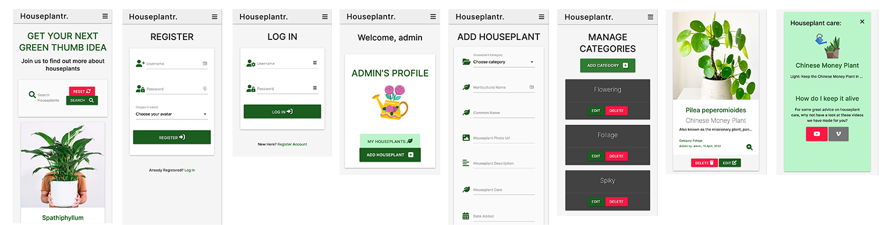
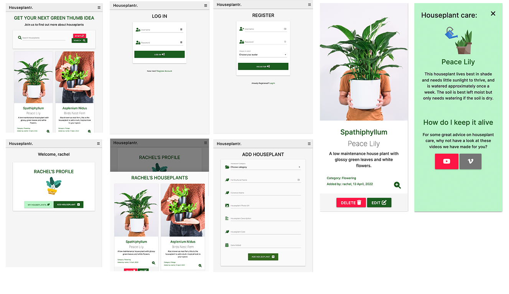

## Testing with admin and user accounts
I have created an admin account which has access to categories pages in addition to the main account pages, a personal account and created six test accounts in order to test the functionality of the app. I tested user authentication and CRUD functionality on each page and across a number of screen sizes and devices.I ensured defensive programming methods to ensure only logged in users could create, edit or delete their own records and not those of other users.

### Tested login form user authentication
[Login Page]()
- Tested that the relevant flash message appeared if the user entered the wrong username or password."Incorrect username and/or password"
- Tested that the relevant flash message appears when the user logs out, to tell the user that they have logged out."You have been logged out"
- Tested that if a logged in user is able to access the login page, they are redirected to their profile. 
- Tested once the user has filled in the login form correctly that they are directed to their profile page and that a flash message appears saying welcome and their name.
 

### Tested register form user authentication link
[Registration Page](https://houseplantr-v1.herokuapp.com/register)
- Tested fields are required fields and cannot be left blank.
- Tested fields allow a minimum length of 5 and maximum length of 15 for either the username and password.
- Tested that the form would only allow usernames and passwords created using characters a-z, A-Z, 0-9. 
- Tested user was able to select an avatar from the drop down list and that the same avatar appeared on their profile page.
- Tested if the user registers successfully  a flash message appears telling the user that they have registered successfully.
- Tested to make sure the database was checked for existing usernames to prevent users registering their accounts more than once. 
- Tested that if a logged in user is able to access the register page, they are redirected to their profile.

### Tested internal links.
These links are on the login and registration pages, so users can easily move between login and registration pages if they have selected the wrong one.

### Tested user profile
- User has to be logged in to test page.
- Tested the My Houseplants button enables the display of a modal with users own houseplant records.
- Checked that only the records created by the user themselves were displaying in the modal on the profile page. 
- Tested a flash message appeared if the user had no houseplant record "No results found".
- Tested the edit and delete buttons on the modal page functioned correctly.
- Tested that only the logged in user was permitted to edit or delete houseplant records & other users were redirected to the home page if they tried to edit or delete another users record.

### Tested add houseplant form validation
[Add Houseplant](https://houseplantr-v1.herokuapp.com/add_houseplant)
- Tested all the fields are required fields and cannot be left blank: 
- Tested the character length on the name input field must be a minimum of 5 and maximum of 50 characters.
- Tested the character length on the description and paint care input fields must be a minimum of 5 and maximum or 150 characters.
- Tested the date picker allows only selection of plus or minus 3 years.
- Tested the drop down category menu contains all categories in the database, that a category can be selected and the field not left blank.
- Tested the URL field must receive only urls and not text for example. However, on testing I discovered this field could be left blank. I therefore updated the field to 'required' in add_houseplant.html.
- Tested the submit button added the record to the database and can be seen listed in MongoDB.
- Tested that the user is directed to the home page with a flash message to tell the user that their Houseplant has been successfully added.  
[Add Houseplant page](screenshots/add-houseplant_layout.png)
### Tested edit houseplant form validation
- Tested all the fields are required fields and cannot be left blank: 
- Tested the character length on the name input field must be a minimum of 5 and maximum of 50 characters.
- Tested the character length on the description and paint care input fields must be a minimum of 5 and maximum or 150 characters.
- Tested the date picker allows only selection of plus or minus 3 years.
- Tested the drop down category menu contains all categories in the database, that a category can be selected and the field not left blank.
- Tested the URL field must receive only urls and not text for example. However again, on testing I discovered this field could be left blank. I therefore updated the field to 'required' in edit_houseplant.html.
- Tested the cancel button takes the user back to the homepage.
- Tested that once the user clicks the edit button after making changes, the user receives a flash message that says their Houseplant has been successfully updated.
- Tested that once the user clicks the delete button, the user receives a flash message that says their Houseplant has been successfully delete, and that the houseplant record is deleted from the layout and the database.

### Tested homepage
[Homepage](https://houseplantr-v1.herokuapp.com/get_houseplants)
![Homepage](screenshots/desktop-browser-views.png
- Checked the edit and delete buttons on the home page functioned correctly, and that only the logged in user was permitted to edit or delete their own houseplant records. The edit and delete buttons were inaccessible to other users or to users who were not logged in.
- Tested reveal functionality where users can find out how to care for their houseplants by clicking on the magnifying icon or the houseplant image.
- Tested external links on the reveal section which provide user access to houseplant care videos and a potential feature in the future - A Houseplantr houseplants channel. For now, the links point to houseplant care videos on YouTube and Vimeo. I tested to check they the links opened at the correct destination and in a new tab.

### Tested search functionality
- Tested that users could search the index in the houseplants collection. I used words and phrases included or not included in the houseplants collection. The search functionality always showed records when the keyword/phrase existed. If a keyword/phrase didn't exist, then a flash message appeared saying  'No results found'. I tested searching other collections such as Users, but this did not show, which is correct as only one index could be set up and I set it to the Houseplants Collection.
- Tested the reset button returned the homepage layout to its default setting.

### Tested navigation links.
All navigation links on desktop and mobile were tested  to make sure they linked to the relevant pages.

### Tested access to admin only pages.
[Manage Categories](https://houseplantr-v1.herokuapp.com/add_houseplant)
- I tested to see if a user could access the manage categories  admin only page. If attempted, non admin accounts were not able to access manage categories and were redirected to the homepage as planned. 
- I tested if non-admin accounts were able to create, edit or delete categories, If attempted, non admin accounts were not able to access this functionality and were redirected to the homepage as planned.

## Tested admin only access CRUD functionality
- I tested to make sure the Manage Categories tab in the navigation displayed only when logged in as admin
- I tested to make sure admin accounts were able to add, edit or delete categories on the Manage Categories page.
- I tested the Add Category button took user to an input field where a new category could be added.
- Tested the input field was required and limited entries to between 3 and 20 characters.
[image manage categories}

## Browser testing and responsivity
- The desktop App was tested on Google Chrome, Internet Explorer, Microsoft Edge and Safari browsers, to check for responsive layouts and functionality on all pages. I tested all page layouts on a number of screensizes, which all proved responsive to the screen size.The homepage view is illustrated below:  

- The App was tested on a variety of devices including
- Mobile screen - Iphone 12 pro:  
. 
- Tablet layout - iPad mini   

- Medium screen - Surface Pro7:

- Large screen - iMac 27"   
 

## Device testing CRUD functionality.
- I tested adding a houseplant record on iPhone 11 device, then edited it and deleted it without any issues.
- I tested adding a houseplant record on iMac 27” device, then edited it and deleted it without any issues.
- I tested adding a houseplant record on MacBook 13" device, then edited it and deleted it without any issues.
- I tested adding a houseplant record on Microsoft Surface device, then edited it and deleted it without any issues.

# Security testing
## Session cookie
As a logged in user, I tested by deleting the session cookie in Dev Tools that the user would be logged out and returned to the login page, and secondly a flash message would appear saying you must login to view this page.

## Defensive programming
On testing the app it became apparent that users could access other users accounts, if they were able to copy the url to another users page. It was therefore necessary to find a way of denying access to unauthorised account users.
To do this I added a decorator which wraps and replaces another function. I used functools.wraps() to handle this.
- To ensure user profiles were not accessible to logged out users or incorrect users, I used the decorator @login required and a redirect to return the incorrect user to their profile page.
- To ensure the register, login, logged out, add houseplant, edit houseplant, delete houseplant pages were not accessible to logged in users, I used an if statement where, if a user is already logged in, if they tried to access the these pages, they would be redirected to their profile page.
- I ensured that update and delete houseplant records could only be updated by the user who originally added the record by using an if statement. Incorrect users would be redirected to the home page with a flash message saying you don't have access to edit/update this page. 
- To ensure users were not able to access admin only pages, such as Manage Categories, I added the decorator @login required as well as an if statement to check if the user was an admin. If not, the user would be redirected to the home page and a flash message would appear to indicate the user does not have access to the categories page. The same defensive programming was applied to the add, edit and delete category functions.
[@ login required decorator](screenshots/login-required-decorator.png)

## Flash message examples
Throughout testing I have referred to the 'flash messages' that inform the user when they have completed an action within the app. Some of these are illustrated below:

